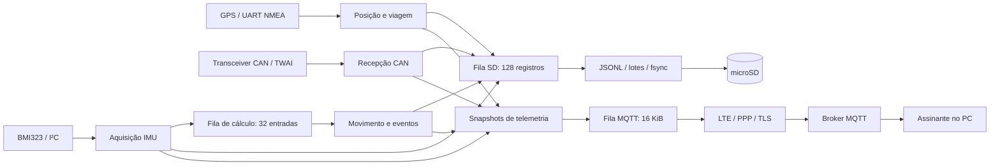

# Move2 — Telemetria embarcada para motocicleta elétrica

O Move2 coleta dados de IMU, GPS e barramento CAN em uma LILYGO T-A7670G SA R2, grava o histórico em microSD e publica telemetria ao vivo por MQTT usando LTE. O armazenamento local funciona independentemente da conexão: a falta de cobertura ou do broker não impede a aquisição local.

O projeto está em desenvolvimento e validação de bancada. A configuração de referência utiliza **IMU a 100 Hz**, **I²C a 400 kHz**, **CAN a 500 kbit/s** e mensagens separadas de GPS e IMU a cada **500 ms**. Distância, orientação e eventos são estimativas calculadas, com critérios e limitações documentados abaixo.

## Conteúdo

- [Arquitetura e tecnologias](#arquitetura-e-tecnologias)
- [Hardware e pinagem](#hardware-e-pinagem)
- [Configuração, build e gravação](#configuração-build-e-gravação)
- [Frequências, tarefas e memória](#frequências-tarefas-e-memória)
- [Calibração e movimento](#calibração-e-movimento)
- [GPS e cálculo de viagem](#gps-e-cálculo-de-viagem)
- [Contrato MQTT e variáveis](#contrato-mqtt-e-variáveis)
- [Gravação local no SD](#gravação-local-no-sd)
- [Acompanhamento no computador](#acompanhamento-no-computador)
- [Logs e diagnóstico operacional](#logs-e-diagnóstico-operacional)
- [Testes e validação](#testes-e-validação)
- [Estrutura do repositório](#estrutura-do-repositório)
- [Limitações e próximos passos](#limitações-e-próximos-passos)
- [Referências](#referências)

## Arquitetura e tecnologias



O boot habilita a alimentação dos periféricos e inicia SD, GPS, IMU, CAN e telemetria antes da conectividade. LTE tenta recuperar registro e PPP; o cliente MQTT administra a conexão ao broker. Wi-Fi existe como alternativa selecionada na compilação, sem troca automática LTE/Wi-Fi.

| Tecnologia | Aplicação |
|---|---|
| C / ESP-IDF | Firmware e drivers do ESP32 |
| FreeRTOS | Tarefas, filas, notificações e proteção de dados compartilhados |
| `esp_timer` | Tempo monotônico e notificação periódica da aquisição IMU |
| I²C master | Comunicação com o BMI323 |
| UART / NMEA | Recepção GPS e interpretação de RMC/GGA |
| TWAI | Controlador CAN clássico do ESP32, com transceiver externo |
| SPI / SDSPI / FatFs / VFS | Acesso ao cartão e arquivos JSONL |
| `esp_modem`, PPP e lwIP | Transporte IP pelo modem celular |
| ESP-MQTT / TLS | Publicação assíncrona e verificação de certificados pelo bundle do ESP-IDF |
| SNTP | Sincronização de horário UTC pela rede |
| Python / Paho MQTT / PyMongo | Assinatura no PC e ingestão opcional em MongoDB |

A build de referência usa **ESP-IDF 6.1.0**, alvo `esp32`, `espressif/esp_modem` **2.1.0** e `espressif/mqtt` **1.1.0**, conforme [dependencies.lock](Firmware/dependencies.lock). O manifesto declara IDF `>=5.3`, mas isso não comprova compatibilidade com todas essas versões: o código utiliza APIs de drivers do ambiente de referência.

## Hardware e pinagem

### Componentes

| Componente | Função e configuração |
|---|---|
| LILYGO T-A7670G SA R2 | Placa principal com ESP32, modem e slot TF/microSD |
| SIMCom A7670G | LTE por SIM com serviço de dados; UART a 115200 bit/s |
| BMI323 externo | Acelerômetro, giroscópio e temperatura interna |
| Receptor GPS da montagem | Saída NMEA por UART a 9600 bit/s, 8N1; modelo exato não identificado pelo código |
| Transceiver CAN externo | Interface elétrica entre GPIOs e CANH/CANL; conferir o modelo instalado |
| microSD | Histórico em sistema FAT compatível; FAT32 é a referência de uso |
| Antenas e alimentação | Antenas correspondentes ao LTE/GPS e alimentação conforme a revisão da placa |

A pinagem descreve o firmware atual. Confira a revisão física no [material da LILYGO](https://github.com/Xinyuan-LilyGO/LilyGo-Modem-Series) antes de reproduzir a montagem. A lógica conectada aos GPIOs deve ser compatível com 3,3 V. O ESP32 não deve ser ligado diretamente a CANH/CANL: o transceiver é necessário.

### BMI323 — I²C

Altere a fiação com a alimentação desligada. A montagem atual substitui o SPI anterior do BMI323:

| Sinal do BMI323 | Ligação | Observação |
|---|---|---|
| SDA / MOSI | GPIO32 | Dados I²C |
| SCL / SCK | GPIO18 | Clock a 400 kHz |
| CSB / CS | 3,3 V | Seleção da interface I²C |
| SDO / MISO | GND | Endereço de 7 bits `0x68` |
| Alimentação do módulo | 3,3 V, conforme o breakout | Conferir VCC/VDD/VDDIO do módulo |
| GND | GND comum | Referência compartilhada |
| INT1 / INT2 | Não utilizados | Consulta periódica de data-ready |

SDA/SCL precisam de pull-ups adequados para 3,3 V; o firmware também habilita os internos. **GPIO39 fica livre. GPIO13 deixa de se conectar ao BMI323, mas permanece reservado ao CS interno do cartão.**

A configuração usa acelerômetro **±8 g**, giroscópio **±500 °/s** e ODR padrão **100 Hz**. Conversões nominais: `acc_raw × 9,80665 / 4096` em m/s² e `gyr_raw / 65,536` em °/s. Especificações e escalas: [datasheet BMI323](https://www.bosch-sensortec.com/media/boschsensortec/downloads/datasheets/bst-bmi323-ds000.PDF).

### microSD — SPI2 dedicado

| Sinal | GPIO |
|---|---:|
| MOSI / DI | 15 |
| MISO / DO | 2 |
| SCLK | 14 |
| CS | 13 |

Esses pinos pertencem ao slot TF. A frequência efetiva do SPI aparece no log de montagem; não é o clock de 400 kHz do I²C. O firmware utiliza a configuração padrão do host SDSPI e informa a frequência obtida.

`MOVE2_SD_MISO_WAIT_MS=1` reduz a espera pré-comando por MISO com CS inativo no barramento dedicado. O driver mantém as verificações de ocupado durante as operações. Compartilhar SPI2 exige revisar essa configuração e o circuito; 40 ms corresponde à espera padrão do driver utilizado.

### GPS — UART2

As direções abaixo são vistas pelo **ESP32**:

| Sinal | GPIO | Conexão |
|---|---:|---|
| UART2 TX | 21 | ESP32 TX → RX do GPS |
| UART2 RX | 22 | ESP32 RX ← TX do GPS |
| WAKEUP | 19 | Habilitação do receptor |
| PPS | Desabilitado | GPIO23 destinado ao CAN |

UART a **9600 bit/s, 8N1**, sem controle de fluxo. O firmware interpreta o fluxo recebido; não configura uma frequência maior de navegação no receptor. Nos testes de referência, o RMC atualiza aproximadamente a 1 Hz.

### CAN — TWAI

| Sinal | GPIO padrão | Conexão |
|---|---:|---|
| TWAI TX | 23 | TXD/CTX do transceiver |
| TWAI RX | 36 | RXD/CRX do transceiver |
| Referência | GND | Referência adequada entre placa, transceiver e barramento |

CANH/CANL são conectados pelo transceiver, com alimentação, terminação e topologia apropriadas. O bitrate padrão é **500000 bit/s**. GPIO36 é somente entrada e não tem pull-up interno; RXD deve fornecer o nível lógico. O firmware utiliza CAN clássico, não CAN FD. Consulte também [HARDWARE_LTE_CAN.md](Firmware/HARDWARE_LTE_CAN.md).

### LTE e sinais reservados

| Sinal | GPIO | Uso |
|---|---:|---|
| UART1 TX do ESP32 | 26 | RX do modem |
| UART1 RX do ESP32 | 27 | TX do modem |
| PWRKEY | 4 | Sequência de ativação |
| POWERON | 12 | Alimentação de periféricos, mantida em nível alto |
| RESET | 5 | Reset do modem |
| DTR | 25 | Controle do modem |
| RI/RING | 33 | Reservado pela placa; não usado na lógica atual |
| Console UART0 | 1 / 3 | Logs e monitor serial |

GPIO26/27 não estão disponíveis para CAN. A recuperação LTE não pulsa GPIO12, preservando a alimentação dos periféricos durante a coleta.

## Configuração, build e gravação

### Ambiente

Instale o ESP-IDF com as ferramentas para ESP32 e abra um terminal com o ambiente ativado, ou use o terminal ESP-IDF da extensão do VS Code. A build utiliza CMake e Ninja. Exemplo no Windows, ajustando os caminhos:

```powershell
. C:\esp\v6.1\esp-idf\export.ps1
cd C:\caminho\move2\Firmware
idf.py --version
idf.py menuconfig
```

O repositório não depende de um script próprio `activate_esp_idf.ps1`. Execute os comandos ESP-IDF dentro de `Firmware` e confira que o alvo é `esp32`.

### Opções do projeto

Os símbolos abaixo estão sem o prefixo `CONFIG_`. `menuconfig` salva em `Firmware/sdkconfig`; [sdkconfig.defaults](Firmware/sdkconfig.defaults) fornece valores para configurações novas e **não sobrescreve automaticamente** um `sdkconfig` existente.

| Menu / símbolo | Referência | Significado |
|---|---|---|
| `Move2 Connectivity / MOVE2_USE_LTE` | Habilitado | LTE/PPP; desabilitado seleciona Wi-Fi |
| `MOVE2_LTE_APN` | Conforme operadora | APN do SIM |
| `MOVE2_LTE_APN_USER`, `MOVE2_LTE_APN_PASS` | Conforme operadora | Autenticação PPP |
| `MOVE2_LTE_CONNECT_TIMEOUT_MS` | 60000 ms | Espera por IP PPP; não limita toda a sequência de registro |
| `MOVE2_MQTT_URI` | Conforme broker | `mqtts://host:8883`, `mqtt://host:1883` ou `wss://host/mqtt` |
| `MOVE2_MQTT_USERNAME`, `MOVE2_MQTT_PASSWORD` | Conforme broker | Credenciais MQTT |
| `Move2 Hardware Pins / MOVE2_CAN_TX_GPIO` | 23 | TX do transceiver |
| `MOVE2_CAN_RX_GPIO` | 36 | RX do transceiver |
| `MOVE2_CAN_BITRATE` | 500000 bit/s | Bitrate CAN |
| `Move2 Local Recording / MOVE2_IMU_RATE` | 100 Hz | Escolha de 100, 200 ou 400 Hz |
| `MOVE2_IMU_ODR_HZ` | Derivado da escolha | ODR utilizada pelo driver |
| `MOVE2_SD_QUEUE_LENGTH` | 128 registros | Capacidade da fila SD |
| `MOVE2_SD_SYNC_MS` | 250 ms | Tempo de formação de lote antes de solicitar escrita/sync |
| `MOVE2_SD_FILE_MB` | 64 MiB | Rotação após um lote atingir o limite |
| `MOVE2_SD_MISO_WAIT_MS` | 1 ms | Espera pré-comando no SPI2 dedicado |
| `Move2 Motion and Trip / MOVE2_BODY_X_AXIS` | +1 | Eixo do sensor apontando para frente |
| `MOVE2_BODY_Y_AXIS` | +2 | Eixo apontando para esquerda |
| `MOVE2_BODY_Z_AXIS` | +3 | Eixo apontando para cima |
| `MOVE2_BRAKING_THRESHOLD_TENTHS` | 30 | Frenagem: 3,0 m/s² |
| `MOVE2_IMPACT_THRESHOLD_TENTHS_G` | 25 | Impacto: 2,5 g |
| `MOVE2_FALL_TILT_DEG` | 60° | Inclinação para possível queda |

Configure explicitamente broker e credenciais: os defaults podem diferir do ambiente local. Um broker em `localhost` ou somente na rede privada do PC não fica acessível ao modem pela rede celular.

O caminho alternativo Wi-Fi utiliza SSID/senha definidos em [wifi_app.c](Firmware/main/wifi_app.c); essa configuração ainda não foi unificada no menu.

Em `Component config > ESP-MQTT Configurations`, a referência é:

```text
CONFIG_MQTT_USE_CUSTOM_CONFIG=y
CONFIG_MQTT_POLL_READ_TIMEOUT_MS=50
CONFIG_MQTT_OUTBOX_EXPIRED_TIMEOUT_MS=3000
CONFIG_MQTT_REPORT_DELETED_MESSAGES=y
```

O poll de 50 ms evita a espera padrão de um segundo entre ciclos do cliente instalado. O vencimento de 3 s favorece mensagens recentes; depende da execução da tarefa e não garante um prazo de entrega.

### Build, flash e monitor

```powershell
idf.py build
idf.py -p COM5 flash monitor
```

Substitua `COM5` pela porta da placa; no Linux, use a porta correspondente, como `/dev/ttyUSB0`. Para apenas abrir o monitor, use `idf.py -p COM5 monitor`. Saia com `Ctrl+]`.

O artefato principal é `Firmware/build/CAN_READER.bin`, nome herdado do projeto CMake. Utilize `idf.py flash` para gravar também bootloader e tabela de partições.

A configuração local de referência usa cabeçalho de flash de **2 MiB** e partição única de aplicação de **1 MiB**. Confira a capacidade física de cada placa: detectar 4 MiB com cabeçalho de 2 MiB não aumenta automaticamente a partição. OTA não está implementado.

## Frequências, tarefas e memória

| Fluxo | Frequência / política | Destino |
|---|---|---|
| IMU bruta | ODR nominal de 100 Hz; consulta de data-ready a 200 Hz | SD, inclusive durante calibração |
| Movimento | Cada entrada calibrada; resumo de aproximadamente 500 ms | SD `motion` e snapshot MQTT |
| NMEA | Toda linha completa recebida, até 191 bytes | SD `gps_nmea` |
| Viagem | Cada RMC novo processado; aproximadamente 1 Hz nos testes | SD `trip` e snapshot MQTT |
| CAN bruto | Cada frame entregue pelo driver, sujeito à capacidade de recepção/fila | SD `can` |
| MQTT IMU | A cada 500 ms, quando calibrada e recente | `moto/sensores` |
| MQTT GPS | A cada 500 ms, incluindo estado sem fix | `moto/sensores` |
| MQTT CAN | Snapshot completo dos quatro IDs ou timeout de 500 ms com dados | `moto/can` |
| Monitor `LIVE` | Aproximadamente 1 Hz | Console |
| Registro `health` | Aproximadamente 5 s, sujeito à tarefa do SD | SD e relatório serial |

**100 Hz de aquisição não significa 100 mensagens MQTT por segundo.** A rede recebe snapshots; o SD mantém as leituras brutas mais frequentes. GPS próximo de 1 Hz publicado a 2 Hz produz coordenadas repetidas em mensagens consecutivas.

A aquisição da IMU tem prioridade 5. Os cálculos ficam em `motion_task`, prioridade 3, com fila de **32 entradas**, cerca de **1,5 KiB**, e **4 KiB de stack**. Enfileirar não espera por espaço. Uma entrada descartada incrementa `motion_queue_dropped`; a próxima descontinuidade de sequência reinicializa o filtro. Essa fila é independente da fila SD.

A fila SD utiliza **128 × até 216 bytes**, aproximadamente **27 KiB**, mais lote de **8 KiB** e buffer de linha de **1536 bytes**. Sua tarefa reserva 6 KiB de stack; telemetria também reserva 6 KiB. A outbox MQTT tem limite de **16 KiB**. Esses valores não representam toda a RAM utilizada por ESP-IDF, TLS, modem e drivers.

Os buffers absorvem atrasos curtos, mas não corrigem vazão insuficiente. ODR de 200/400 Hz exige medição com LTE, cartão e CAN reais antes de ser adotada.

## Calibração e movimento

### Eixos e referências

O padrão de bancada é **X para frente, Y para esquerda e Z para cima**. No menu, `+1/-1` representam X/-X do sensor, `+2/-2` representam Y/-Y e `+3/-3` representam Z/-Z. Exemplo: `-2,1,3` significa frente em -Y, esquerda em +X e cima em +Z.

Os eixos devem ser distintos, não nulos e formar uma rotação de mão direita. Um mapeamento inválido desabilita os cálculos derivados, mantendo a aquisição bruta. A configuração é uma permutação de eixos com sinais, não uma matriz arbitrária de alinhamento.

Após cerca de 1 s de estabilização, a calibração reúne `2 × ODR` amostras. A janela deve ter baixa variação e norma compatível com a gravidade; caso contrário, é repetida. Normalmente termina perto de 3 s, mas pode demorar mais se houver movimento.

Os critérios atuais são: desvio padrão máximo por eixo de 80 contagens do acelerômetro e 65,536 do giroscópio; média absoluta por eixo do giroscópio de até 10 °/s; norma média entre 0,85 g e 1,15 g. São critérios de estabilidade, não prova de imobilidade absoluta.

Há duas referências de aceleração:

- `accelerometer.x/y/z`: campos legados nos eixos do sensor, com offsets de inicialização que levam o repouso a aproximadamente `(0, 0, 9,81)`.
- Campos derivados: preservam a direção medida e aplicam escala comum `4096 / norma(media_acc_raw)`, fixa após a calibração. Isso aproxima a norma de repouso de 1 g sem forçar a inclinação para zero.

O giroscópio recebe compensação do bias médio. `acc_raw` e `gyr_raw` no SD permanecem intactos. Uma calibração em uma única pose não identifica offsets individuais do acelerômetro, desalinhamento da montagem ou todas as diferenças de escala entre eixos.

### Filtros e eventos

A direção da gravidade é propagada pelo giroscópio e corrigida lentamente pelo acelerômetro quando as condições permitem. A subtração dessa gravidade fornece aceleração linear estimada, filtrada com constante de tempo de 50 ms. Vibração usa passa-alta de aproximadamente 2 Hz e RMS combinado dos três eixos.

Roll/pitch são calculados no fechamento da janela; eventos continuam sendo avaliados por entrada. Lacunas superiores a 100 ms, timeout da fila ou perda detectada na sequência reinicializam filtro/janela. Os contadores de eventos são preservados até o reboot. Resumos com mais de 1 s são apresentados como inválidos.

| Evento | Critério padrão |
|---|---|
| Frenagem | Aceleração longitudinal <−3 m/s² por pelo menos 250 ms, com velocidade GPS recente ≥5 km/h |
| Impacto | Norma de aceleração ≥2,5 g, com intervalo mínimo de 1 s entre eventos |
| Possível queda | Inclinação da vertical >60° por pelo menos 1 s; impacto ou rotação >100 °/s nos últimos 5 s; GPS abaixo de 3 km/h ou indisponível |

Frenagem e queda contam uma vez enquanto a condição persistir. Ligar a placa inclinada, sem precursor, não deve contar como queda. Manuseio em bancada pode produzir eventos. `eventsExperimental` indica critérios ainda sujeitos a validação na montagem final.

Roll/pitch não fornecem rumo absoluto e podem ser afetados por aceleração sustentada, curvas e bias residual. O firmware não calcula posição integrando duas vezes a aceleração. A temperatura é interna ao chip, não do motor ou da bateria.

## GPS e cálculo de viagem

RMC fornece posição, velocidade, curso e data/hora; GGA fornece qualidade, satélites, HDOP e altitude. Ambas exigem checksum correto e campos válidos. RMC repetido ou anterior ao último instante aceito não renova a idade do fix nem acumula viagem.

A posição exige fix aceito com idade **menor que 3000 ms**. Sem isso, latitude/longitude MQTT são `null`; uma posição real `(0, 0)` continua permitida. `ANTENNA OK` é uma mensagem do receptor, não confirmação de fix.

A viagem também exige **pelo menos 4 satélites**, **HDOP ≤4**, GGA recente e qualidade de fix de 1 a 5. Qualidades GGA 0, 6, 7 e 8 não são aceitas como fix satelital nessa lógica. HDOP não é diretamente erro em metros; altitude pode oscilar com a placa parada. Definições: [RMC](https://docs.novatel.com/OEM7/Content/Logs/GPRMC.htm) e [GGA](https://docs.novatel.com/OEM7/Content/Logs/GPGGA.htm).

O filtro de viagem:

1. Inicia uma candidatura quando a velocidade atinge **5 km/h**.
2. Confirma movimento após pelo menos **4 segundos** de fixes contínuos aceitos nessa velocidade ou acima, com deslocamento de pelo menos **8 metros** desde o início da candidatura.
3. Cancela a candidatura abaixo de 5 km/h. Movimento já confirmado termina a **2,5 km/h ou menos**.
4. Interrompe a integração em intervalos superiores a **2,5 s**, falha de qualidade ou salto incompatível com a velocidade; a recuperação exige nova confirmação.
5. Em movimento, acumula distância geográfica a partir de uma âncora quando o deslocamento chega a **2 m**. Durante parada, reposiciona a âncora sem somar distância.

O limite de salto por par é `max(20 m, 2 × velocidade_maior_em_m/s × intervalo_em_s + 10 m)`. O ponto rejeitado pode continuar aparecendo como posição GPS; `tripTracking=false` indica que ele não foi integrado.

**O trecho de confirmação não é recuperado retroativamente.** Esse intervalo entra no tempo sem movimento confirmado, e a distância começa na posição de confirmação. A escolha reduz falsos deslocamentos em bancada, mas subestima partidas, movimento lento e trechos com sinal ruim. Não garante eliminar toda deriva GPS.

`speedKmh` mantém a velocidade informada pelo receptor, inclusive pequenas oscilações em repouso; `maxSpeedKmh` só aumenta durante movimento confirmado. Distância, tempos e máxima reiniciam no boot. Falta de fix não é contabilizada como parada. A média é `tripDistanceM × 3,6 / movingTimeS`, com zero antes de haver tempo de movimento.

## Contrato MQTT e variáveis

### Transporte e tópicos

| Propriedade | Valor atual |
|---|---|
| Sensores | `moto/sensores` |
| CAN | `moto/can` |
| Filtro para assinar tudo | `moto/#` |
| QoS de publicação | 0 |
| Retain | `false` |
| Outbox | 16 KiB, assíncrona |
| Histórico após reconexão | Sem replay automático do SD |

QoS 0 não confirma entrega ao broker. `enviados_fila` significa aceitação na fila do cliente. Durante desconexão, a coleta continua, mas a outbox não funciona como histórico persistente.

Os exemplos são ilustrativos. Nomes, capitalização e unidades fazem parte do contrato. Consumidores devem aceitar campos adicionais e `null` quando a medição estiver indisponível.

### GPS — `sensorId: gps_modulo`, `sensorType: gps`

```json
{
  "sensorId": "gps_modulo",
  "sensorType": "gps",
  "value": {
    "latitude": -8.055338,
    "longitude": -34.951803,
    "satellites": 8,
    "valid": true,
    "fixQuality": 1,
    "ageMs": 100,
    "positionStatus": "valido",
    "speedKmh": 0.0,
    "courseDeg": null,
    "altitudeM": 42.5,
    "hdop": 0.9,
    "tripDistanceM": 0.0,
    "movingTimeS": 0.0,
    "stoppedTimeS": 30.0,
    "averageSpeedKmh": 0.0,
    "maxSpeedKmh": 0.0,
    "timeToFirstFixS": 11.4,
    "tripTracking": true,
    "moving": false
  },
  "unit": "\u00b0",
  "timestamp": 1790045000000
}
```

| Campo em `value` | Unidade / interpretação |
|---|---|
| `latitude`, `longitude` | Graus decimais; `null` sem posição válida recente |
| `satellites` | Quantidade na última GGA; verificar também frescor/qualidade |
| `valid` | Posição válida e recente |
| `fixQuality` | Código da última GGA; 1 corresponde a fix autônomo |
| `ageMs` | Idade do último fix aceito em ms; `null` enquanto indisponível |
| `positionStatus` | `sem_dados`, `sem_fix`, `desatualizado` ou `valido` |
| `speedKmh` | Velocidade RMC em nós ×1,852; `null` se inválida/desatualizada |
| `courseDeg` | Curso sobre o solo; `null` abaixo de 3 km/h ou sem dado válido; não é bússola |
| `altitudeM` | Altitude GGA em metros relativa ao nível médio do mar; exige fix e GGA recentes |
| `hdop` | Qualidade geométrica horizontal, adimensional; exige GGA recente |
| `tripDistanceM` | Distância acumulada nos trechos confirmados, em m |
| `movingTimeS` | Tempo integrado em movimento confirmado, em s |
| `stoppedTimeS` | Tempo válido sem movimento confirmado, incluindo candidatura, em s |
| `averageSpeedKmh` | Média nos intervalos integrados de movimento |
| `maxSpeedKmh` | Máxima aceita durante movimento confirmado |
| `timeToFirstFixS` | Tempo desde inicialização do GPS ao primeiro fix RMC; `null` até ocorrer |
| `tripTracking` | Qualidade e frescor permitem acompanhar; não significa movimento |
| `moving` | Movimento confirmado; `null` se acompanhamento indisponível |

### IMU — `sensorId: imu`, `sensorType: Imu`

```json
{
  "sensorId": "imu",
  "sensorType": "Imu",
  "value": {
    "accelerometer": {"x": 0.0, "y": 0.0, "z": 9.81},
    "gyroscope": {"x": 0.0, "y": 0.0, "z": 0.0},
    "motionValid": true,
    "imuTemperatureC": 26.7,
    "accelerationMagnitude": 9.807,
    "linearAcceleration": {"x": 0.001, "y": -0.002, "z": 0.003},
    "longitudinalAcceleration": 0.001,
    "jerk": 0.15,
    "vibrationRms": 0.025,
    "peakAcceleration": 9.85,
    "rollDeg": 0.4,
    "pitchDeg": 2.6,
    "windowMs": 500,
    "windowSamples": 50,
    "eventsExperimental": true,
    "events": {
      "braking": false,
      "impact": false,
      "possibleFall": false,
      "brakingCount": 0,
      "impactCount": 0,
      "possibleFallCount": 0
    }
  },
  "timestamp": 1790045000000
}
```

| Campo em `value` | Unidade / interpretação |
|---|---|
| `accelerometer.x/y/z` | m/s², inclui gravidade; eixos do sensor com calibração legada |
| `gyroscope.x/y/z` | °/s, eixos do sensor com bias compensado |
| `motionValid` | Resumo calculado disponível e recente |
| `imuTemperatureC` | °C: `23 + temp_raw/512`; sentinela raw −32768 gera `null` |
| `accelerationMagnitude` | Norma da aceleração com escala corrigida, incluindo gravidade, m/s² |
| `linearAcceleration.x/y/z` | Aceleração filtrada sem gravidade estimada, eixos da moto, m/s² |
| `longitudinalAcceleration` | Componente X da aceleração linear, m/s² |
| `jerk` | Norma da derivada da aceleração linear filtrada, m/s³ |
| `vibrationRms` | RMS combinado do passa-alta na janela, m/s² |
| `peakAcceleration` | Maior norma de aceleração da janela, incluindo gravidade, m/s² |
| `rollDeg`, `pitchDeg` | Inclinações lateral/longitudinal estimadas, em graus |
| `windowMs` | Duração efetiva da janela, em ms |
| `windowSamples` | Entradas integradas; próximo de 50 a 100 Hz |
| `eventsExperimental` | Sempre `true` nesta implementação |
| `events.braking`, `events.impact`, `events.possibleFall` | Evento detectado na janela concluída |
| `events.brakingCount`, `events.impactCount`, `events.possibleFallCount` | Contadores desde o boot |

O payload IMU exige calibração e leitura bruta com idade inferior a 100 ms. Se apenas o resumo derivado estiver indisponível, `motionValid=false`, as medições derivadas ficam `null` e os booleanos de eventos ficam falsos. Metadados da última janela e contadores podem permanecer presentes.

As grandezas instantâneas derivadas representam o fim da janela; RMS, pico e eventos representam a janela completa. Os campos legados utilizam o snapshot bruto mais recente, podendo ter alguns milissegundos de diferença. Para reconhecer eventos após perder mensagens, observe incrementos dos contadores e trate reboot como nova sessão.

### CAN — array de snapshots

```json
[
  {
    "canId": "0x00000014",
    "dlc": 8,
    "data": "1122334455667788",
    "timestamp": 1790045000000
  }
]
```

| Campo | Significado |
|---|---|
| `canId` | Identificador hexadecimal em string |
| `dlc` | Quantidade de bytes do snapshot, até 8 |
| `data` | Bytes em hexadecimal sem separadores |
| `timestamp` | Relógio do sistema no ciclo de montagem/publicação, em ms |

O MQTT seleciona `0x00000014`, `0x1803F3F4`, `0x000006A0` e `0x000006A1`. Repetições de um ID atualizam seu snapshot. Nomes internos como bateria/SOC/motor não constituem decodificação validada: os bytes continuam brutos. O SD recebe também os demais IDs entregues pelo driver e preserva flags estendido/RTR.

### Horários e compatibilidade

`timestamp` MQTT é um inteiro de 64 bits em milissegundos do relógio do sistema, representando UTC quando sincronizado. **Antes do SNTP, ainda não é um horário civil confiável.** Não representa o instante individual de todas as amostras de uma janela.

As correções de repouso mantêm tópicos, identificadores e campos legados, mas alteram a confirmação de viagem e a escala dos campos derivados. `motion_queue_dropped` foi acrescentado ao registro SD `health` e ao log serial, não ao payload MQTT de sensores.

## Gravação local no SD

O cartão é montado em `/sdcard`. Utilize um volume FAT compatível previamente preparado; `format_if_mount_failed=false` impede formatação automática. A integração usa FatFs via VFS/POSIX, conforme a [documentação do ESP-IDF](https://docs.espressif.com/projects/esp-idf/en/stable/esp32/api-reference/storage/fatfs.html).

Os produtores entregam registros compactos sem esperar por espaço na fila. Uma única tarefa converte para JSONL, reúne até 8 KiB e executa escrita seguida de `fsync`. O lote fecha quando falta espaço reservado para uma linha máxima ou quando atinge o intervalo configurado.

```text
/sdcard/<boot-hexadecimal-de-16-digitos>-<segmento-de-6-digitos>.jsonl
```

Cada linha é um objeto JSON independente. O segmento muda após um lote atingir 64 MiB, podendo ultrapassar esse limite por um lote. A abertura exclusiva evita sobrescrever arquivos existentes.

### Envelope comum

| Campo | Significado |
|---|---|
| `v` | Versão do formato, atualmente 1 |
| `boot` | Identificador aleatório de 64 bits da sessão, em hexadecimal |
| `seq` | Sequência global de tentativas de registro; lacunas podem indicar descarte |
| `mono_us` | Tempo monotônico em microssegundos capturado pelo produtor |
| `timestamp_ms` | UTC correspondente a `mono_us` se houver âncora SNTP na formatação; senão, `null` |
| `type` | `imu`, `gps_nmea`, `can`, `motion`, `trip` ou `health` |

`mono_us` permite analisar coletas totalmente offline. Registros formatados antes da sincronização mantêm `timestamp_ms=null`; arquivos antigos não são reescritos. Filas concorrentes e cálculo assíncrono podem produzir linhas fora da ordem estrita de `mono_us`; ordene pelo tempo ao reconstruir trajetórias.

### Tipos de registro

| `type` | Campos específicos |
|---|---|
| `imu` | `acc_raw[3]`, `gyr_raw[3]`, `temp_raw`, `sensor_time`, `status`, `acc_conf`, `gyr_conf`, `calibrated` |
| `gps_nmea` | `sentence`: linha sem CR/LF, com escape JSON; inclui linhas rejeitadas pelo parser |
| `can` | `id` numérico, `extended`, `rtr`, `dlc`, `data` hexadecimal; RTR não tem dados |
| `motion` | `value` com os campos derivados, janela e eventos; não inclui os campos legados `accelerometer`/`gyroscope` |
| `trip` | `value` com latitude/longitude e métricas de viagem; não duplica todos os metadados GPS do MQTT |
| `health` | Contadores de aquisição, filas e gravação descritos abaixo |

Em `imu`, `sensor_time` é o contador de 32 bits do BMI323, com base de 25,6 kHz e wrap; não é UTC nem número de amostras. `status`, `acc_conf` e `gyr_conf` são registradores. `calibrated` informa o estado da calibração no momento do registro; raw permanece sem compensação.

Exemplo antes da sincronização de horário:

```json
{"v":1,"boot":"0123456789abcdef","seq":123,"mono_us":1234560,"timestamp_ms":null,"type":"imu","acc_raw":[0,0,4096],"gyr_raw":[0,0,0],"temp_raw":1536,"sensor_time":31604,"status":192,"acc_conf":16424,"gyr_conf":16424,"calibrated":false}
```

### Contadores `health`

| Campo | Unidade / interpretação |
|---|---|
| `accepted[3]`, `dropped[3]` | Registros aceitos/descartados na ordem CAN, IMU, NMEA; descarte também pode ocorrer na formatação |
| `derived_dropped[2]` | Resumos descartados pela gravação, na ordem movimento, viagem |
| `motion_queue_dropped` | Entradas descartadas antes do cálculo; independente da fila SD |
| `queued`, `queue_peak` | Ocupação atual e maior ocupação observada da fila SD |
| `committed` | Registros em lotes cuja escrita e sync retornaram sucesso |
| `committed_bytes` | Bytes desses lotes |
| `io_errors` | Falhas de montagem, abertura, escrita, sync ou fechamento tratadas pelo gravador |
| `max_write_us` | Maior duração de tentativa de escrita + sync, em µs |
| `max_queue_age_ms` | Maior idade do registro ao sair da fila, em ms |
| `last_data_us`, `max_data_us` | Duração recente/máxima das escritas, em µs |
| `last_sync_us`, `max_sync_us` | Duração recente/máxima de `fsync`, em µs |
| `last_batch_bytes`, `last_batch_records` | Tamanho do último lote tentado |
| `imu_samples`, `imu_errors` | Amostras coletadas e erros de leitura/configuração |
| `imu_missed_estimate` | Estimativa de lacunas pelo intervalo do relógio do sensor |
| `can_received`, `can_cloud_dropped`, `can_bus_errors` | Frames recebidos, descartes da fila de telemetria CAN e erros do driver |
| `gps_overflows` | Linhas excedendo o buffer NMEA; não representa todas as possíveis perdas de UART |

### Falhas, retenção e recuperação

Em falha de escrita/sync, o lote permanece em RAM e é tentado novamente em outro segmento com as mesmas sequências. O SD tenta recuperação após aproximadamente 5 s. Isso pode duplicar linhas escritas antes da falha: leitores devem deduplicar por **`(boot, seq)`** e reconhecer uma possível última linha incompleta.

A gravação protege o histórico contra **indisponibilidade LTE**, enquanto cartão, alimentação e vazão forem suficientes. Cartão cheio, ausente ou lento pode esgotar a fila. Não existe exclusão automática dos arquivos antigos.

O intervalo de 250 ms é uma política de formação de lote, **não garantia de perder no máximo 250 ms em corte de energia**. Filas, latência do cartão e metadados FAT também importam. Não há comando de encerramento controlado/download; não retire o cartão enquanto a placa grava.

Para estimar duração do armazenamento, meça `Δcommitted_bytes / Δtempo` sob carga real. `espaço_livre / bytes_por_segundo` fornece uma estimativa de autonomia. CAN e quantidade de sentenças GPS podem alterar bastante esse resultado.

## Acompanhamento no computador

### Assinar MQTT

Utilize o mesmo broker e credenciais do firmware, com tópico `moto/#` ou apenas `moto/sensores`. O exemplo abaixo usa TLS e porta 8883; confirme as opções habilitadas no seu broker.

Instale `paho-mqtt` e salve o exemplo como um script local:

```python
import getpass
import json
import os
from datetime import datetime
import paho.mqtt.client as mqtt

host = os.environ["MQTT_BROKER"]  # Host, sem mqtts://
port = int(os.environ.get("MQTT_PORT", "8883"))
client = mqtt.Client(mqtt.CallbackAPIVersion.VERSION2)
username = os.environ.get("MQTT_USERNAME", "")
if username:
    client.username_pw_set(username, getpass.getpass("Senha MQTT: "))
client.tls_set()

def on_connect(client, userdata, flags, reason_code, properties):
    print("Conexão:", reason_code)
    if reason_code == 0:
        client.subscribe("moto/#")

def on_message(client, userdata, message):
    text = message.payload.decode("utf-8", errors="replace")
    try:
        text = json.dumps(json.loads(text), ensure_ascii=False)
    except json.JSONDecodeError:
        pass
    print(datetime.now().isoformat(timespec="seconds"), message.topic, text)

client.on_connect = on_connect
client.on_message = on_message
client.connect(host, port, 60)
client.loop_forever()
```

```powershell
python -m pip install paho-mqtt
$env:MQTT_BROKER = "host-do-seu-broker"
$env:MQTT_PORT = "8883"
python seu_assinante.py
```

O horário do assinante é o recebimento no PC; `timestamp` no JSON vem do ESP32. Para um mapa, verifique `valid` antes de usar coordenadas. Para viagem, observe também `tripTracking` e `moving`.

### Serviço opcional MQTT → MongoDB

A pasta [MQTT](MQTT) contém um receptor Python separado do firmware. Variáveis de ambiente: `MQTT_BROKER`, `MQTT_PORT`, `MQTT_TOPIC`, `MQTT_USERNAME`, `MQTT_PASSWORD`, `MONGO_URI`, `MONGO_DB_NAME` e `MONGO_COLLECTION_NAME`.

```powershell
python -m pip install paho-mqtt pymongo
$env:MQTT_BROKER = "host-do-seu-broker"
$env:MQTT_PORT = "8883"
$env:MQTT_TOPIC = "moto/sensores"
$env:MONGO_URI = "mongodb://localhost:27017"
python MQTT/main.py
```

Configure também as credenciais necessárias. O serviço usa TLS e adiciona `mqtt_topic` e `received_at` aos documentos. Seu tópico padrão histórico é `esp32/can_leitura`, portanto precisa ser ajustado.

**Limitação:** o callback atual espera um objeto JSON e não trata o array de `moto/can`. Utilize `moto/sensores` na ingestão existente; adaptar arrays CAN é uma etapa separada. O assinante simples acima permite visualizar ambos os formatos.

## Logs e diagnóstico operacional

O console anuncia `Coleta local iniciada. Conectividade em background.`. A ordem dos demais logs pode variar devido às tarefas concorrentes.

| Log / situação | Interpretação e verificação |
|---|---|
| `BMI323 detectado via I2C ... ODR=100 Hz` | Sensor identificado e configuração conferida |
| `Calibracao concluida` / `Escala do acelerometro...` | Repouso aceito; aguardar o primeiro resumo |
| `Movimento na calibracao` | Janela rejeitada; manter estabilidade e conferir montagem |
| `GPS=sem_dados` | Sem bytes na UART; conferir alimentação e pinos |
| `GPS=sem_fix` | Comunicação presente, mas sem posição atual aceita |
| `GPS=desatualizado` | Última posição aceita tem pelo menos 3 s |
| `tracking=1`, velocidade pequena e distância zero | Qualidade permite acompanhar, mas movimento não foi confirmado |
| `SD montado` / `Gravando ...jsonl` | Cartão acessível e segmento aberto |
| `queue`, `peak`, `age_max_ms` aumentando | Investigar latência/vazão do SD sob carga |
| `perdas_novas`, `dropped`, `derived_dropped` aumentando | Registros não estão sendo preservados integralmente |
| `motion_queue_dropped` aumentando | Cálculo não acompanhou; não implica automaticamente perda de raw no SD |
| `estimated_missed` aumentando | Consultas irregulares; comparar taxa real e erros I²C |
| `LTE indisponivel ... coleta local continua` | Aquisição ativa durante as tentativas de conexão |
| `MQTT=conectado` | Cliente conectado; conferir chegada no assinante |
| `enviados_fila` | Mensagens aceitas na outbox, não confirmações do broker |
| `falhas`, `cheias`, `expiradas` | Falhas de enqueue, subconjunto por fila cheia e remoções por idade |
| `fila_bytes` | Ocupação amostrada no último enqueue/evento, não necessariamente instantânea |
| `gravados/s` | Taxa de registros sincronizados de todos os tipos, não a ODR da IMU |
| `MISO baixo com CS inativo` | Conferir circuito/pull-up do GPIO2 e latência de escrita |
| Erro de pull-up em GPIO36 | Entrada sem pull-up interno; conferir se RXD dirige corretamente o pino |

`estimated_missed` mantém o critério original: diferenças do relógio do sensor acima de 1,5 período e menores que 1 s geram uma estimativa de lacunas. O instante da consulta influencia o resultado; não é contagem exata de perdas, e lacunas longas não são somadas por esse critério.

`io_errors=0` ou `falhas=0` isoladamente não provam ausência de perdas. Os produtores deixam de tentar publicação durante desconexão, e as filas têm contadores independentes.

## Testes e validação

### Testes no computador

A suíte compila os módulos C portáveis usados no firmware. São necessários Python e compilador C de host. No Windows, utilize o ambiente Developer Command Prompt/PowerShell do Visual Studio com MSVC; compilador apenas para ESP32 não substitui o compilador de host.

Na raiz do repositório:

```powershell
python Firmware/tests/run_host_tests.py
```

O runner aceita `CC` para selecionar o compilador. A suíte verifica:

- Escrita parcial, retorno zero, falha de sync, preservação/reenvio de lote e limites de buffers.
- JSON CAN/RTR, IMU, NMEA escapada, `health`, GPS e resumos; timestamps de 64 bits.
- Checksum, valores inválidos, perda de fix, RMC repetido/fora de ordem, meia-noite e wrap do relógio.
- Deriva em repouso, picos curtos de velocidade, velocidade sem deslocamento, confirmação de viagem e recuperação após perda de qualidade.
- Calibração inclinada com norma de 9,7 m/s², preservação do ângulo, correção do resíduo e rejeição de janelas instáveis.
- Gravidade, vibração senoidal, frenagem, impacto curto, possível queda, montagem alternativa e invalidação após lacunas.

Verifique o firmware com `idf.py build`. Testes portáveis e compilação não medem latência do cartão, escalonamento real das tarefas ou precisão dos sensores na moto.

### Roteiro de bancada e campo

1. Ligue com a placa parada e aguarde a calibração. A norma corrigida deve se aproximar de 9,81 m/s² e a aceleração linear de zero, sem exigir roll/pitch zerados.
2. Deixe parada por vários minutos com fix. Em uma nova sessão, observe distância/máxima zeradas, mesmo que `speedKmh` oscile abaixo dos critérios de confirmação.
3. Calcule `Δimu_samples / Δsegundos` e compare com a ODR. Acompanhe `estimated_missed`, `motion_queue_dropped`, descartes SD e filas.
4. Confira chegada no assinante. Interrompa a conectividade de forma controlada e verifique que aquisição/gravação continuam; depois, confira reconexão.
5. Teste deslocamento real, partida, parada e perda de sinal, considerando o atraso intencional da confirmação.
6. Repita com tráfego CAN real e cartão destinado ao uso antes de elevar a ODR.
7. Ao analisar cópias dos arquivos, valide cada JSON, identifique cauda incompleta e deduplique por `(boot, seq)`.

## Estrutura do repositório

```text
move2/
├── Firmware/
│   ├── CMakeLists.txt           # Projeto ESP-IDF CAN_READER
│   ├── dependencies.lock       # Versões resolvidas
│   ├── sdkconfig.defaults      # Configuração inicial
│   ├── HARDWARE_LTE_CAN.md      # Conexões LTE/CAN
│   ├── main/
│   │   ├── main.c              # Inicialização e conectividade
│   │   ├── Kconfig.projbuild   # Opções do projeto
│   │   ├── idf_component.yml   # Dependências
│   │   ├── bmi_app.*           # I²C, aquisição e tarefa de movimento
│   │   ├── imu_calibration.h   # Calibração e estabilidade
│   │   ├── motion.*            # Gravidade, filtros e eventos
│   │   ├── imu_format.*        # Payload IMU
│   │   ├── gps_app.*           # UART e captura NMEA
│   │   ├── gps_navigation.*    # Parser e viagem
│   │   ├── gps_metrics.h       # Estado das métricas
│   │   ├── gps_format.*        # Validade e payload GPS
│   │   ├── can_app.*           # Recepção TWAI
│   │   ├── telemetry_app.*     # Snapshots MQTT e LIVE
│   │   ├── mqtt_app.*          # Cliente e outbox
│   │   ├── lte_app.*           # Modem e PPP
│   │   ├── wifi_app.*          # Alternativa Wi-Fi
│   │   ├── sntp_app.*          # Sincronização e horário
│   │   ├── sd_app.*            # Montagem, filas e recuperação
│   │   ├── sd_record.*         # Tipos e serialização JSONL
│   │   ├── sd_batch.*          # Lotes e confirmação da escrita
│   │   └── json_writer.h      # Escrita JSON com limites
│   └── tests/                  # Testes C e runner Python
├── MQTT/                       # Ingestão opcional MQTT → MongoDB
├── docs/telemetria_calculada.md # Detalhamento dos cálculos
└── README.md
```

`Firmware/build` e `Firmware/managed_components` são gerados pelo ambiente. Alterações devem ficar no código/configuração próprios, evitando editar cópias geradas dos componentes.

## Limitações e próximos passos

- Ainda não há download do SD por USB/rede nem apresentação do cartão como unidade de disco no PC.
- Não há replay MQTT, confirmação de entrega fim a fim, retenção circular ou exclusão automática de arquivos.
- A IMU usa consulta periódica; FIFO e interrupção física data-ready não estão integrados.
- Viagem e eventos exigem validação na montagem final; os limiares são critérios iniciais de engenharia.
- A integração GPS perde o trecho de confirmação e pode subestimar curvas e movimentos lentos.
- Decodificação CAN, novos diagnósticos remotos e ingestão de arrays CAN permanecem para etapas futuras.
- O envelope MQTT não inclui identificador único da placa/boot. Várias placas nos mesmos tópicos exigem evolução do contrato para distinguir origem/sessão.
- Credenciais devem ser configuradas para a implantação; defaults de desenvolvimento não constituem provisionamento de produção.

## Referências

- Hardware e revisões: [LilyGo-Modem-Series](https://github.com/Xinyuan-LilyGO/LilyGo-Modem-Series).
- Especificações e registradores: [Bosch BMI323](https://www.bosch-sensortec.com/media/boschsensortec/downloads/datasheets/bst-bmi323-ds000.PDF).
- Armazenamento: [FatFs no ESP-IDF](https://docs.espressif.com/projects/esp-idf/en/stable/esp32/api-reference/storage/fatfs.html).
- Tarefas e escalonamento: [FreeRTOS no ESP-IDF](https://docs.espressif.com/projects/esp-idf/en/stable/esp32/api-reference/system/freertos_idf.html).
- Campos NMEA: [RMC](https://docs.novatel.com/OEM7/Content/Logs/GPRMC.htm) e [GGA](https://docs.novatel.com/OEM7/Content/Logs/GPGGA.htm).
- Detalhes da implementação: [Telemetria calculada](docs/telemetria_calculada.md).
